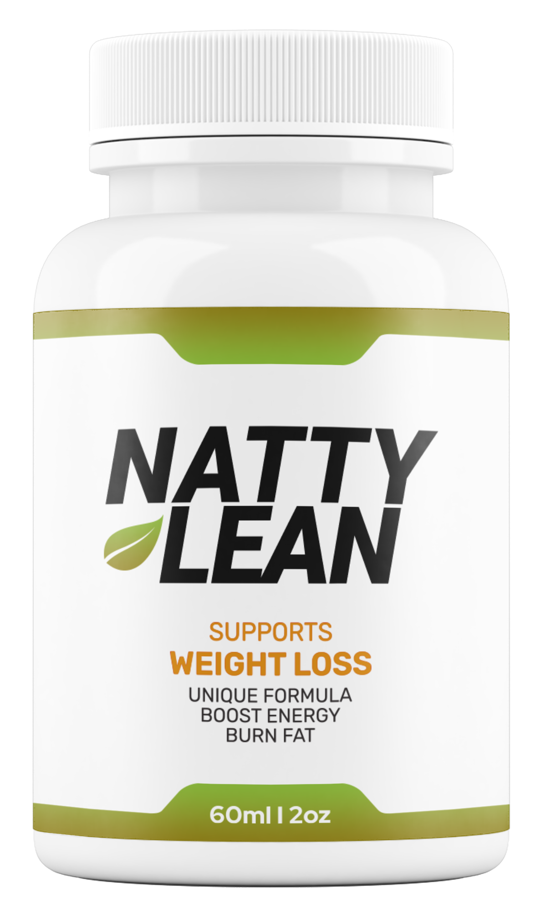

# 📦 Natty Lean VSL Challenge — Interactive Landing Page

A fully responsive, accessible and modular Video Sales Letter (VSL) landing page built for a fictional product called **Natty Lean**. This project was designed to simulate a real-world sales funnel experience with dynamic offer generation, time-limited promotions, and order confirmation workflows — applying clean code principles and modern frontend practices.

---

## 🚀 Project Overview

The goal was to build an interactive product landing page capable of:

- Embedding a dynamic video player (YouTube, Vimeo, or local MP4)
- Triggering time-sensitive sales offers and bonuses after video playback
- Dynamically generating offers based on device viewport (desktop/mobile logic)
- Collecting user data via a validated purchase form modal
- Displaying a customized order confirmation page with dynamic order details and bonuses
- Implementing a theme inspired by **mocha + matcha** natural tones via CSS Variables
- Ensuring accessibility compliance, keyboard navigation, ARIA landmarks and alt descriptions
- Providing responsive and performant design, optimized for mobile-first browsing

---

## 📂 Project Structure

```
hw-vsl-challenge/
├── assets/
│   ├── css/
│   │   ├── main.css              # Core layout and utility styles
│   │   └── theme-nature.css      # Mocha + Matcha themed customization
│   ├── img/                      # Product, badges, offer and bonus assets
│   └── js/
│       ├── modules/
│       │   └── data.js           # Centralized data: offers, FAQs, bonuses, references
│       ├── main.js               # Main page logic, video handling, offer triggers
│       └── thankyou.js           # Thank You page order summary logic
├── favicon.ico
├── index.html                    # Main VSL landing page
├── thankyou.html                 # Order confirmation page
└── README.md
```

---

## ⚙️ Tech Stack & Tools

- **HTML5 / CSS3**
- **JavaScript ES6 (modules)**
- **Bootstrap 5.3**
- **Bootstrap Icons**
- **YouTube IFrame API**
- **CSS Variables for theming**
- **Vanilla JavaScript DOM manipulation**

---

## 📌 Key Features

👉 Responsive grid system and adaptive layout
👉 Dynamic video player loader (YouTube / Vimeo / MP4 local)
👉 Auto-triggered sales funnel layout upon video milestone (20:14 mark)
👉 Modular countdown timers with accessibility-friendly ARIA labels
👉 Offer grids generated via data-driven modules (viewport-based sorting)
👉 Bonus delivery logic based on quantity selected
👉 Fully validated purchase modal form with fallback behaviors
👉 Accessible modal dialogs, forms and navigation landmarks
👉 Themed via CSS custom properties (theme-nature.css)
👉 Modularized JavaScript: separation of concerns for data, logic and view updates
👉 Clean and semantic HTML with ARIA roles and landmarks

---

## 📖 Customization

All configurable content is centralized inside:

```js
/assets/js/modules/data.js
```

Where you can easily update:

- Product information
- Offer packages and pricing
- Bonus items and images
- FAQs content
- Scientific references
- Footer legal disclaimers

---

## 👨‍💻 How to Run Locally

To test video APIs and dynamic routing via URL params, a local server is recommended:

**With Python (v3):**

```bash
python -m http.server
```

Then visit:
[http://localhost:8000](http://localhost:8000)

---

## 📊 Performance & Accessibility Practices

- **Preloaded critical resources** (CSS, JS, images)
- **Lazy loading images** and YouTube API
- **Accessible focus styles**
- **Keyboard navigable modals and accordions**
- **Responsive typography and spacing**
- **Reduced motion preferences respected**
- **ARIA landmarks and labels applied to all dynamic components**

---

## 📸 Project Preview



---

## 📄 License & Disclaimer

This project is for educational/demo purposes.
All names, images and content are fictional.

---

## 📌 Author

**Marcy** — Frontend Developer & UI Designer
